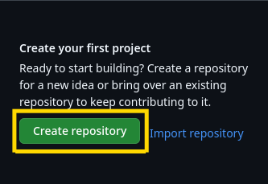
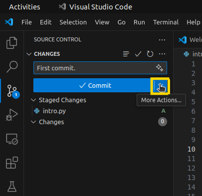
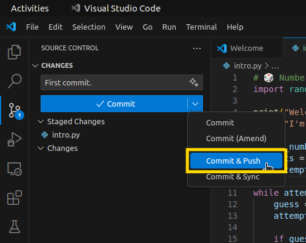

# Guide to setup GitHub & VSCode

---
## GitHub
1. Open the GitHub website, `https://github.com/`, and create a account.

   <!--width="600" height="auto" />-->

2. After creating an account, create a repository.

   <!--width="600" height="auto" />-->

3. Give it a name and make it `Public`. Also, make sure `Add a README file` box is checked.

   <!--width="600" height="auto" />-->

4. Notice that currently you are in the main branch. It is recommended that the development work is done on a seperate branch. To create a new branch, click `Branch`.

   <!--width="600" height="auto" />-->

5. Click on the `New branch` button and give it a name. Generally, the developement branch is called `devel` but you can name it as per your liking.

   <!--width="600" height="auto" />-->

   <!--width="600" height="auto" />-->

---

## Virtual Studio Code
1. Open VsCode. I would recommend to open a new window and start fresh. Go to `File` and open `New window`.

   <!--width="600" height="auto" />-->

2. Open `Explorer` and Clone the repository.

   <!--width="600" height="auto" />-->

   <!--width="600" height="auto" />-->

   <!--width="600" height="auto" />-->

3. Sign in to your GitHub account.

   <!--width="600" height="auto" />-->

**Note:** I already have a github account, so I chose the `Sign in to another account` option.

4. After signing in, the browser will redirect to the VSCode. Click the `Clone Repositiory` button again.

   <!--width="600" height="auto" />-->

   <!--width="600" height="auto" />-->

5. You should see the name of your repository, as `<your username>/<your repo name>`. Clone it in your favorable location. If you are using Ubuntu, I would recommend `Home` directory. Open the repo after cloning.

   <!--width="600" height="auto" />-->

   <!--width="600" height="auto" />-->

   <!--width="600" height="auto" />-->

6. Now, lets create a python file. Add a file and name it `intro.py`. Open the `example.txt`, copy the code and paste it in your newly created python file.

   <!--width="600" height="auto" />-->

   <!--width="600" height="auto" />-->

   <!--width="600" height="auto" />-->

7. Open the `Extensions` tab and install `Python Extension` and `Debugger`.

   <!--width="600" height="auto" />-->

   <!--width="600" height="auto" />-->

   <!--width="600" height="auto" />-->

**Note:** I already have the extensions and debugger, so there is no `install` option.

8. Go back to `Explorer` tab and `intro.py` file. At the top right corner, you will see the `Run` button.

   <!--width="600" height="auto" />-->

**Note:** Follow step 9 only if when trying to run the program it ask to select a kernel.

9. Click on `Select a Kernel`. Choose the kernel source and select the recommended `/usr/bin/python3` python environment. After that close the `Interactive` window.

   <!--width="600" height="auto" />-->

   <!--width="600" height="auto" />-->

   <!--width="600" height="auto" />-->

   <!--width="600" height="auto" />-->

10. Run the program. This is a number game. It will output a score if you guess the correct number and based on how many trial it took you to guess the number.

   <!--width="600" height="auto" />-->

11. Now lets push the code to your repository. Open the `Source Control` tab.

   <!--width="600" height="auto" />-->

  * First stage your changes.
    

       <!--width="600" height="auto" />-->
    

  * Add a commit message.
    

       <!--width="600" height="auto" />-->
    

  * Select `Commit & Push` option in `More Actions`.
    

       <!--width="600" height="auto" />-->
    

    

       <!--width="600" height="auto" />-->
    

12. Open your repo and check if the changes are pushed. You should see the newly created `intro.py` file.

   <!--width="600" height="auto" />-->

---

**CONGRATS!!, you successfully created a python file and pushed it to GitHub. Now you are PRO!!**